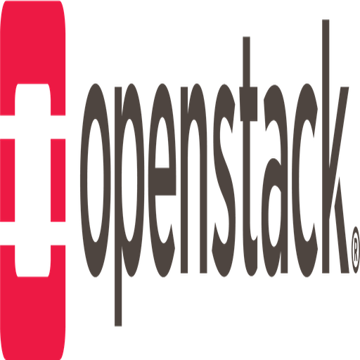

  
  &nbsp;&nbsp;&nbsp;&nbsp;
  

# aws_vs_openstack_technology

Mapping AWS services to OpenStack projects and common ecosystem tools.

## Overview

This repository contains a curated, up‑to‑date comparison of AWS services and their closest OpenStack equivalents (or external alternatives where there is no direct match).
The primary source is an Excel workbook that captures 121 AWS services (as of Dec 2025) grouped into 10 domains:

- Compute Services
- Storage Services
- Networking Services
- Database Services
- Security & Identity Services
- Management & Monitoring Services
- Application Integration Services
- Analytics Services
- Machine Learning & AI Services
- Content Delivery & Edge Services

For each AWS service, the comparison records:

- Category (e.g. Compute, Storage, Networking)
- AWS service name
- OpenStack equivalent (or “no direct” / external solution)
- Description and mapping notes
- AWS lifecycle / availability status
- OpenStack project status as of the 2025.2 release

This is intended as a practical aid for architects and engineers who are:

- Evaluating migrations between AWS and OpenStack
- Designing hybrid or multi‑cloud architectures
- Checking which capabilities require native OpenStack projects vs. external tooling

## Key files

- `aws-openstack-comparison_checked.xlsx`  
  Main comparison matrix with columns: Category, AWS Service, OpenStack Equivalent, Description/Notes,
  AWS lifecycle / availability (check), and OpenStack status (2025.2 check).

- `aws-openstack-comparison-reviewed-v2.xlsx`  
  Reviewed version of the same mapping (121 services), focused on equivalence semantics with columns:
  Category, AWS Service, OpenStack Equivalent, Equivalence Type, Description/Notes.

- `aws_vs_openstack_services.txt`  
  Narrative summary of the mapping and service groups, including naming and lifecycle notes for selected AWS services.

- `aws-services.txt`  
  Categorised list of AWS services used as the starting point for the comparison.

- `openstack-services.txt`  
  List of OpenStack services and related tooling referenced by the mapping (e.g. Nova, Neutron, Cinder, Barbican, Zaqar, Mistral).

- `openstack-arch-design.pdf` and `openstack-map-v20250401.pdf`  
  Supporting OpenStack reference material (architecture and service map) for understanding how mapped services fit into a typical OpenStack deployment.

## Icons and visuals

- `aws-icons/light-bg/`  
  AWS architecture icons on a light background. The README uses `aws-icons/light-bg/AWS_Management_Console.png` as the representative AWS icon above.

- `openstack-icons/new-icon/`  
  OpenStack service and logo icons. The README uses `openstack-icons/new-icon/OpenStack-Logo.png` as the representative OpenStack logo.

All AWS and OpenStack logos and icons remain the property of their respective owners; consult their branding and usage guidelines before reusing these assets outside this repository.

## How to use this repository

- Open `aws-openstack-comparison_checked.xlsx` to explore the detailed service‑by‑service mapping, filtering by category or lifecycle/status.
- Use `aws-openstack-comparison-reviewed-v2.xlsx` when you want to reason explicitly about the type of equivalence (native OpenStack, OpenStack + external tooling, or no direct equivalent).
- Refer to the `*-services.txt` files and PDFs for quick, human‑readable overviews when you do not need the full Excel detail.

## Layered Stack Diagram

A visual layered stack (swimlane) diagram comparing AWS and OpenStack services across IaaS, PaaS, FaaS, CaaS, and SaaS categories is provided in `diagram.mmd` using Mermaid syntax.

To generate the image:
1. Copy the content of `diagram.mmd`.
2. Paste it into an online Mermaid editor like [https://mermaid.live](https://mermaid.live).
3. The diagram will render automatically, highlighting the FaaS gap where OpenStack relies on Kubernetes layers.
4. Export as PNG or SVG for use.
